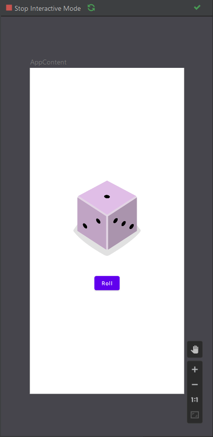

# Basic Dice Roller App 🤖

This is an Basic Dice Roller App built using Kotlin and Jetpack Compose.

## Screenshots

### Library and Dependencies Used 🔗
- [Kotlin](https://kotlinlang.org)
- Jetpack Compose

## Known Issues
- None
